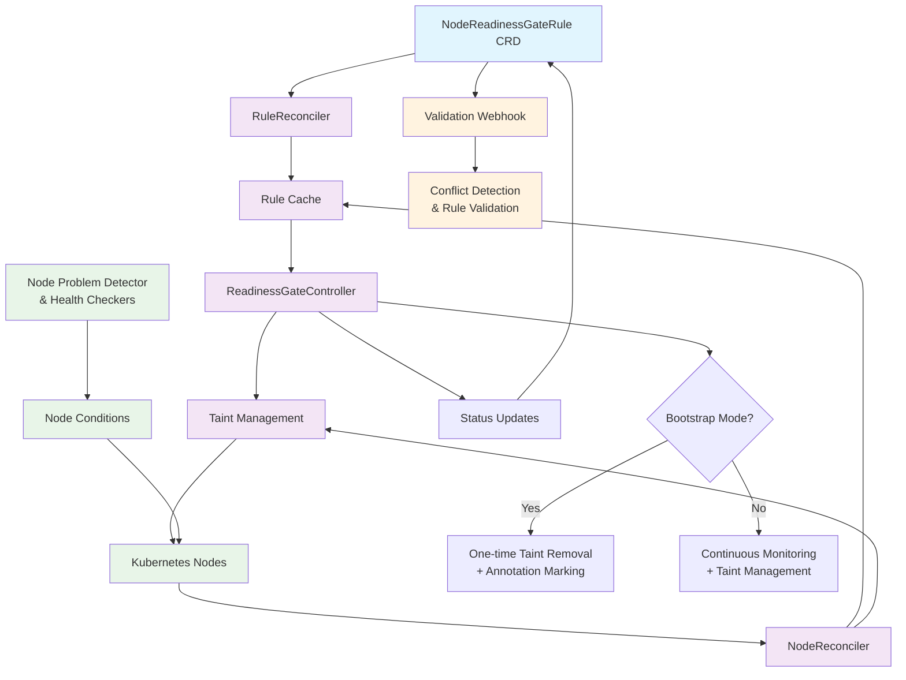

# node-readiness-controller

This repository contains a reference implementation of [NodeReadinessGates](https://github.com/kubernetes/enhancements/pull/5416) as a Kubernetes controller that manages node taints based on multiple readiness gate conditions, providing fine-grained control over when nodes are ready to accept workloads.

## Goals
- Enhance scheduling accuracy by leveraging standardized Node readiness conditions.
- Increase the precision of AutoScaling operations.
- Provide improved observability into Node status and critical component health.

## Overview

The Node Readiness Controller extends Kubernetes' node readiness model by allowing you to define custom readiness rules that evaluate multiple node conditions simultaneously. It automatically manages node taints to prevent scheduling until all specified conditions are satisfied.

Demo here: https://drive.google.com/file/d/14fL7OYJEgUY9qnqSL1Gc_d4rymRRZqHn/view?usp=drive_link

### Key Features

- **Multi-condition Rules**: Define rules that require ALL specified conditions to be satisfied
- **Flexible Enforcement**: Support for bootstrap-only and continuous enforcement modes
- **Conflict Prevention**: Validation webhook prevents conflicting taint configurations
- **Dry Run Mode**: Preview rule impact before applying changes
- **Comprehensive Status**: Detailed observability into rule evaluation and node status
- **Node Targeting**: Use label selectors to target specific node types
- **Bootstrap Completion Tracking**: Prevents re-evaluation once bootstrap conditions are met

## Architecture

```
┌─────────────────┐    ┌──────────────────┐    ┌─────────────────┐
│ NodeReadiness   │    │ ReadinessGate    │    │ Validation      │
│ GateRule CRD    │────▶ Controller       │    │ Webhook         │
└─────────────────┘    └──────────────────┘    └─────────────────┘
                                │                       │
                                ▼                       │
                       ┌─────────────────┐              │
                       │ Node Taints     │              │
                       │ Management      │              │
                       └─────────────────┘              │
                                │                       │
                                ▼                       ▼
                       ┌─────────────────┐    ┌─────────────────┐
                       │ Kubernetes      │    │ Rule Conflict   │
                       │ Nodes           │    │ Detection       │
                       └─────────────────┘    └─────────────────┘

```

Detailed Flow:



### Core Components

#### 1. NodeReadinessGateRule CRD
- Defines rules mapping multiple node conditions to a single taint
- Supports bootstrap-only and continuous enforcement modes
- Allows node selector targeting and grace periods

#### 2. ReadinessGateController
- **RuleReconciler**: Processes rule changes and updates internal cache
- **NodeReconciler**: Handles node condition changes and evaluates applicable rules
- Manages taint addition/removal based on condition satisfaction

#### 3. [WIP] Validation Webhook
- Prevents conflicting rules (same taint key with overlapping node selectors)
- Validates rule specifications and required fields
- Ensures system consistency and prevents misconfigurations

#### 4. Integration with Node Problem Detector (NPD)
Works seamlessly with NPD or any system that sets node conditions:
- NPD plugins update node conditions (e.g., `network.kubernetes.io/CNIReady`)
- Controller watches condition changes and evaluates rules
- Supports custom conditions from any component

## Getting Started

### Quick Start Examples

#### Example 1: Storage Readiness Rule (Bootstrap-only)

This rule ensures nodes have working storage before removing the storage readiness taint:

```yaml
apiVersion: nodereadiness.io/v1alpha1
kind: NodeReadinessGateRule
metadata:
  name: storage-readiness-rule
spec:
  conditions:
    - type: "storage.kubernetes.io/CSIReady"
      requiredStatus: "True"
    - type: "storage.kubernetes.io/VolumePluginReady"
      requiredStatus: "True"
  taint:
    key: "readiness.k8s.io/StorageReady"
    effect: "NoSchedule"
    value: "pending"
  enforcementMode: "bootstrap-only"
  nodeSelector:
    matchLabels:
      node-role.kubernetes.io/worker: ""
```

#### Example 2: Network Readiness Rule (Continuous)

This rule continuously monitors network connectivity:

```yaml
apiVersion: nodereadiness.io/v1alpha1
kind: NodeReadinessGateRule
metadata:
  name: network-readiness-rule
spec:
  conditions:
    - type: "network.kubernetes.io/NetworkReady"
      requiredStatus: "True"
  taint:
    key: "readiness.k8s.io/NetworkReady"
    effect: "NoSchedule"
  enforcementMode: "continuous"
  gracePeriod: "60s"
  dryRun: true  # Preview mode
```

### Rule Specification

| Field | Description | Required |
|-------|-------------|----------|
| `conditions` | List of node conditions that must ALL be satisfied | Yes |
| `conditions[].type` | Node condition type to evaluate | Yes |
| `conditions[].requiredStatus` | Required condition status (`True`, `False`, `Unknown`) | Yes |
| `taint.key` | Taint key to manage | Yes |
| `taint.effect` | Taint effect (`NoSchedule`, `PreferNoSchedule`, `NoExecute`) | Yes |
| `taint.value` | Optional taint value | No |
| `enforcementMode` | `bootstrap-only` or `continuous` | Yes |
| `nodeSelector` | Label selector to target specific nodes | No |
| `gracePeriod` | Grace period before applying taint changes | No |
| `dryRun` | Preview changes without applying them | No |

### Enforcement Modes

#### Bootstrap-only Mode
- Removes bootstrap taint when conditions are first satisfied
- Marks completion with node annotation
- Stops monitoring after successful removal (fail-safe)
- Ideal for one-time setup conditions (storage, installing node daemons e.g: security agent or kernel-module update)

#### Continuous Mode
- Continuously monitors conditions
- Adds taint when any condition becomes unsatisfied
- Removes taint when all conditions become satisfied
- Ideal for ongoing health monitoring (network connectivity, resource availability)

## Deployment

### Option 1: Using Make Commands

**Build and push your image to the location specified by `IMG`:**

```sh
make docker-build docker-push IMG=<some-registry>/nrgcontroller:tag
```

**Install the CRDs into the cluster:**

```sh
make install
```

**Deploy the Manager to the cluster with the image specified by `IMG`:**

```sh
make deploy IMG=<some-registry>/nrgcontroller:tag
```

**Create sample rules:**

```sh
kubectl apply -k config/samples/
```

### Option 2: Using Kustomize Directly

```sh
# Install CRDs
kubectl apply -k config/crd

# Deploy controller with RBAC
kubectl apply -k config/default

# Apply sample rules
kubectl apply -f examples/network-readiness-rule.yaml
```

### Verification

Check that the controller is running:

```sh
kubectl get pods -n nrgcontroller-system
kubectl logs -n nrgcontroller-system deployment/nrgcontroller-controller-manager
```

Verify CRDs are installed:

```sh
kubectl get crd nodereadinessgaterules.nodereadiness.io
```

## Operations

### Monitoring Rule Status

View rule status and evaluation results:

```sh
# List all rules
kubectl get nodereadinessgaterules

# Detailed status of a specific rule
kubectl describe nodereadinessgaterule network-readiness-rule

# Check rule evaluation per node
kubectl get nodereadinessgaterule network-readiness-rule -o yaml
```

The status includes:
- `appliedNodes`: Nodes this rule targets
- `failedNodes`: Nodes with evaluation errors
- `nodeEvaluations`: Per-node condition evaluation results
- `dryRunResults`: Impact analysis for dry-run rules

### Dry Run Mode

Test rules safely before applying:

```yaml
spec:
  dryRun: true  # Enable dry run mode
  conditions:
    - type: "storage.kubernetes.io/CSIReady"
      requiredStatus: "True"
  # ... rest of spec
```

Check dry run results:

```sh
kubectl get nodereadinessgaterule <rule-name> -o jsonpath='{.status.dryRunResults}'
```

### Bootstrap Completion Tracking

For bootstrap-only rules, completion is tracked via node annotations:

```sh
# Check if bootstrap completed for a node
kubectl get node <node-name> -o jsonpath='{.metadata.annotations}'

# Look for: readiness.k8s.io/bootstrap-completed-<ruleName>=true
```

### Troubleshooting

#### Common Issues

1. **Rule conflicts**: Multiple rules targeting the same taint key
   ```sh
   # Check validation webhook logs
   kubectl logs -n nrgcontroller-system deployment/nrgcontroller-controller-manager | grep webhook
   ```

2. **Missing node conditions**: Rules waiting for conditions that don't exist
   ```sh
   # Check node conditions
   kubectl describe node <node-name> | grep Conditions -A 20

   # Check rule evaluation status
   kubectl get nodereadinessgaterule <rule-name> -o yaml | grep nodeEvaluations -A 50
   ```

3. **RBAC issues**: Controller can't update nodes or rules
   ```sh
   # Check controller logs for permission errors
   kubectl logs -n nrgcontroller-system deployment/nrgcontroller-controller-manager

   # Verify RBAC
   kubectl describe clusterrole nrgcontroller-manager-role
   ```

#### Debug Mode

Enable verbose logging:

```sh
# Edit controller deployment to add debug flags
kubectl patch deployment -n nrgcontroller-system nrgcontroller-controller-manager \
  -p '{"spec":{"template":{"spec":{"containers":[{"name":"manager","args":["--zap-log-level=debug"]}]}}}}'
```

## Uninstallation

**Delete all rule instances:**

```sh
kubectl delete nodereadinessgaterules --all
```

**Delete the controller:**

```sh
make undeploy
```

**Delete the CRDs:**

```sh
make uninstall
```

## Advanced Configuration

### Security Considerations

The controller requires the following RBAC permissions:
- **Nodes**: `get`, `list`, `watch`, `patch`, `update` (for taint management)
- **NodeReadinessGateRules**: Full CRUD access
- **Events**: `create` (for status reporting)

### Performance and Scalability

- **Memory Usage**: ~64MB base + ~1KB per node + ~2KB per rule
- **CPU Usage**: Minimal during steady state, scales with node/rule change frequency
- **Node Scale**: Tested up to 100 nodes using kwok (1k nodes in progress)
- **Rule Scale**: Recommended maximum 50 rules per cluster

### Integration Patterns

#### With Node Problem Detector
```yaml
# NPD checks and sets conditions, controller manages taints
conditions:
  - type: "readiness.k8s.io/NetworkReady"  # Set by NPD
    requiredStatus: "False"
```

#### With Custom Health Checkers
```yaml
# Your daemonset sets custom conditions
conditions:
  - type: "readiness.k8s.io/mycompany.example.com/DatabaseReady"
    requiredStatus: "True"
  - type: "readiness.k8s.io/mycompany.example.com/CacheWarmed"
    requiredStatus: "True"
```

#### With Cluster Autoscaler
NRG controller work well with cluster autoscaling:
- New nodes start with restrictive taints
- Controller removes taints once conditions are satisfied
- Autoscaler can safely scale knowing nodes are truly ready

## Development

### Building from Source

```sh
# Clone the repository
git clone https://github.com/ajaysundark/node-readiness-gate-controller.git
cd node-readiness-gate-controller

# Run tests
make test

# Build binary
make build

# Generate manifests
make manifests
```

### Running Locally

```sh
# Install CRDs
make install

# Run against cluster (requires KUBECONFIG)
make run
```

### Contributing

1. Fork the repository
2. Create a feature branch
3. Make changes and add tests
4. Run `make test` to verify
5. Submit a pull request

Please ensure:
- All tests pass (`make test`)
- Code follows Go conventions (`make fmt`, `make vet`)
- New features include unit tests
- Documentation is updated

## API Reference

For detailed API documentation, see the [generated API docs](./docs/api.md) or explore the CRD definition:

```sh
kubectl explain nodereadinessgaterule.spec
kubectl explain nodereadinessgaterule.status
```

## Roadmap

- [ ] Metrics and alerting integration
- [ ] Integration with cluster lifecycle management tools
- [ ] Enhanced conflict resolution strategies
- [ ] Performance optimizations for large clusters
- [ ] Scale testing 1000+ nodes

## Project Distribution

### YAML Bundle

Generate a single YAML file with all resources:

```sh
make build-installer IMG=<registry>/nrgcontroller:tag
kubectl apply -f dist/install.yaml
```

### Helm Chart

```sh
# Generate Helm chart
kubebuilder edit --plugins=helm/v1-alpha

# Install via Helm
helm install nrgcontroller ./dist/chart
```

## Support

- **Issues**: [GitHub Issues](https://github.com/ajaysundark/node-readiness-gate-controller/issues)
- **Discussions**: [GitHub Discussions](https://github.com/ajaysundark/node-readiness-gate-controller/discussions)
- **Documentation**: [Project Wiki](https://github.com/ajaysundark/node-readiness-gate-controller/wiki)

## Contributing
// TODO(ajaysundark): Add detailed information on how you would like others to contribute to this project


## Community, discussion, contribution, and support

Learn how to engage with the Kubernetes community on the [community page](http://kubernetes.io/community/).

You can reach the maintainers of this project at:

- [Slack channel](https://kubernetes.slack.com/messages/sig-node)
- [Mailing List](https://groups.google.com/a/kubernetes.io/g/sig-node)

### Code of conduct

Participation in the Kubernetes community is governed by the [Kubernetes Code of Conduct](code-of-conduct.md).
